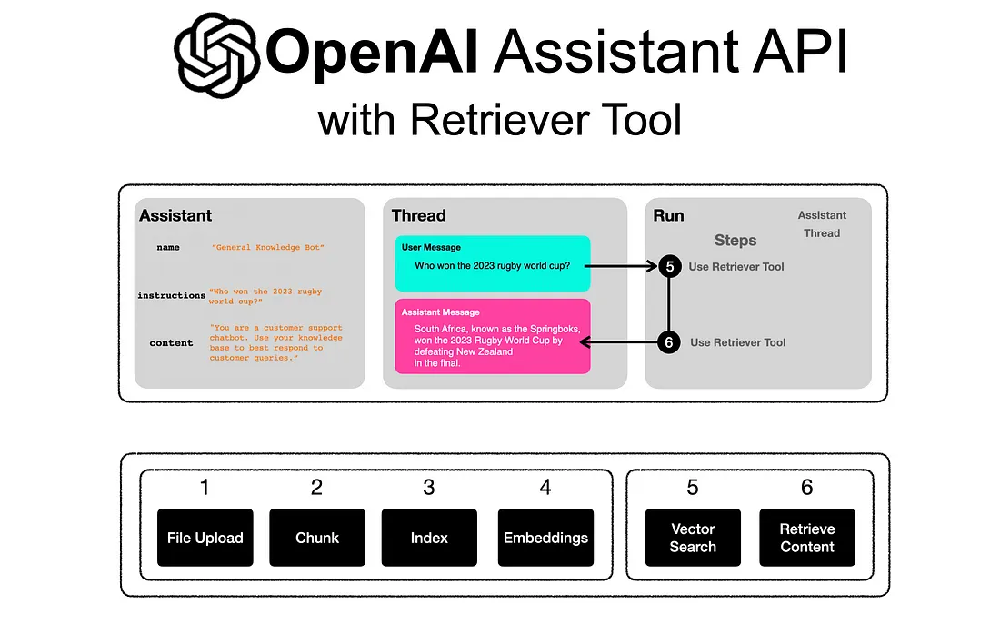
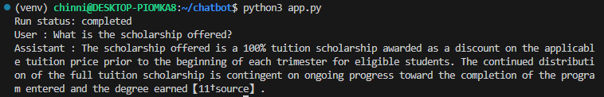
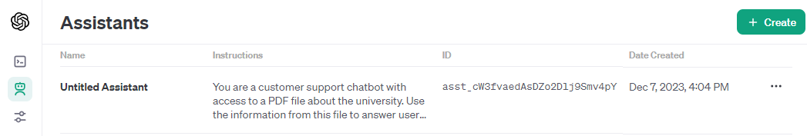
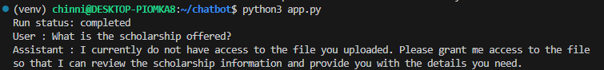

# Chatbot using OpenAI's Assistant API

## Introduction

This document provides an overview of a customer support chatbot designed to answer queries  using a specific PDF file as a knowledge base. The chatbot is developed using OpenAI's GPT-3.5 model and leverages the latest advancements in natural language processing to provide accurate and contextually relevant responses.

## Design



The chatbot system is designed using Python and involves integration with OpenAI's API. The process is outlined below in a tabular format:

<table border=1>
  <tr>
    <th>Step</th>
    <th>Process</th>
    <th>Description</th>
  </tr>

  <tr>
    <td>1</td>
    <td>API Key Configuration</td>
    <td>Configure OpenAI API key using environment variables for secure access.</td>
  </tr>
  <tr>
    <td>2</td>
    <td>File Upload</td>
    <td>Implement file upload mechanism to retrieve data from a specified PDF document.</td>
  </tr>
  <tr>
    <td>3</td>
    <td>Assistant Creation</td>
    <td>Create an AI assistant using OpenAI's GPT-3.5 model, set up to utilize the uploaded file as a knowledge base.</td>
  </tr>
  <tr>
    <td>4</td>
    <td>Message Handling</td>
    <td>Develop a function to handle sending user queries and receiving responses from the assistant, with appropriate formatting.</td>
  </tr>
  <tr>
    <td>5</td>
    <td>Response Retrieval</td>
    <td>Implement a system to retrieve and display responses from the assistant in a conversational format.</td>
  </tr>
</table>


## Implementation

To set up and run the chatbot, follow these steps:

1. Create a Python virtual environment and activate it:
   ```bash
   python3 -m venv venv
   . venv/bin/activate
   ```

2. Install necessary packages:
   ```bash
   pip install openai python-dotenv
   ```

3. Run the application:
   ```bash
   python3 app.py
   ```

## Testing

Here's the result:



The assistant created here can also be tested on the OpenAI web interface.


Note:
- We can also create and test the assistant using the OpenAI Playground web interface. Here's a [tutorial document]()
- An assistant created in the web interface can be used in our project with the assistant ID, eliminating the need to recreate the assistant and upload the file using Python.

- In the current implementation, it's important to note that the assistant API is in beta mode. As a result, there are occasions(as shown) when the assistant may respond indicating that it does not have access to the uploaded document for answering queries. This is a known issue and is expected to be resolved as the API matures and is further developed by OpenAI.



## Enhancement Ideas

Future enhancements can include:
- Improved error handling and logging for more robust operation.
- Integration with a user interface for easier interaction.
- Expansion of the knowledge base to cover a broader range of topics.

## References

For more information, visit:
- OpenAI Assistants Overview: [OpenAI Assistants Documentation](https://platform.openai.com/docs/assistants/overview)