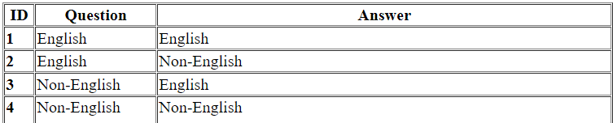

# Customer Support System: An email to the customer

## Introduction

The Customer Support System is a web application that utilizes the OpenAI GPT-3.5 Turbo model to provide customer support for an electronic product company. This system generates customer comments, email subjects, comment summaries, and email responses based on user interactions. It offers support in multiple languages, including English, Spanish, and Portuguese.

[Customer Support System - Email (Google slides)](https://docs.google.com/presentation/d/1fxq3UeToPQSgbxopr5so1hX6S4e7BXGF56z0U8SLZ2w/edit?usp=sharing)

## Design

The system is designed as a Flask web application with a straightforward user interface. Users can select the language in which they want to generate email responses and view the generated customer comment and email response. The application follows these key design components:

- **Flask Web Application**: The application is built using Flask, a lightweight web framework in Python, to handle user interactions.

- **OpenAI Integration**: It integrates with the OpenAI GPT-3.5 Turbo model to generate text-based responses for customer support tasks.

- **HTML Template**: The user interface is designed using an HTML template (`index.html`) with a language dropdown menu, question, and answer containers.


<table border="1" cellpadding="10">
        <thead>
            <tr>
                <th>Step</th>
                <th>Description</th>
                <th>Input to ChatGPT</th>
                <th>ChatGPT's Response</th>
            </tr>
        </thead>
        <tbody>
            <tr>
                <td> 1</td>
                <td>Generate Customer's Comment</td>
                <td>Detailed product descriptions</td>
                <td>A 100-word comment about the products</td>
            </tr>
            <tr>
                <td> 2</td>
                <td>Generate Email Subject</td>
                <td>Customer's comment from Step 1</td>
                <td>Email subject inferred from the customer's comment</td>
            </tr>
            <tr>
                <td> 3</td>
                <td>Generate Comment Summary</td>
                <td>Customer's comment from Step 1, Customer's selected language</td>
                <td>
                    <strong>3.1:</strong> Summary in English using Summarization<br>
                    <strong>3.2:</strong> Translation to the selected language
                </td>
            </tr>
            <tr>
                <td> 4</td>
                <td>Analyze Customer Comment Sentiment</td>
                <td>Customer's comment from Step 1</td>
                <td>Sentiment analysis (Positive/Negative)</td>
            </tr>
            <tr>
                <td> 5</td>
                <td>Generate Customer Email</td>
                <td>
                    Customer's comment from Step 1<br>
                    Comment summary from Step 3.2<br>
                    Sentiment result
                </td>
                <td>An email response to the customer</td>
            </tr>
        </tbody>
    </table>
    
We will test the following:



## Implementation

To run this application, follow these implementation steps:

1. Create a virtual environment:
   ```bash
   python3 -m venv venv
   ```

2. Activate the virtual environment:
   ```bash
   . venv/bin/activate
   ```

3. Install the required Python packages:
   ```bash
   pip install flask openai python-dotenv
   ```

4. Start the Flask application:
   ```bash
   python3 app.py
   ```
   or
   ```
   flask run
   ```

## Test (Output)

Once the application is running, open a web browser and navigate to `http://localhost:5000`. You can then interact with the system as follows:


- Choose the desired language from the dropdown menu.
- View the generated customer comment in the "Question" container.
- Observe the corresponding email response in the "Answer" container.
- Click the "Process" button to initiate the processing of the customer comment.

The application will display the generated email response based on the selected language and customer comment.

<b>English Email generated from English Comment:</b>


<b> Portugese Email generated from English Comment: </b>


## Ngrok Setup 

Ngrok is a tool that allows you to expose a web server running on your local machine to the internet. 

Follow [this document]() to expose your web server to internet. 