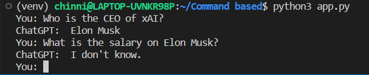
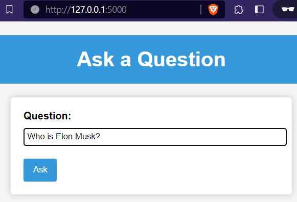
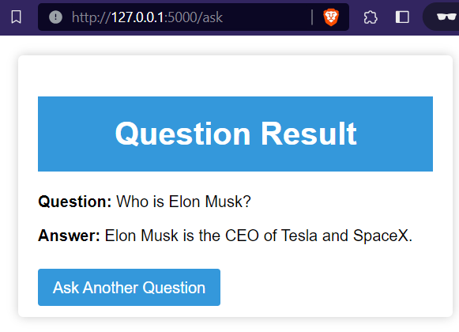
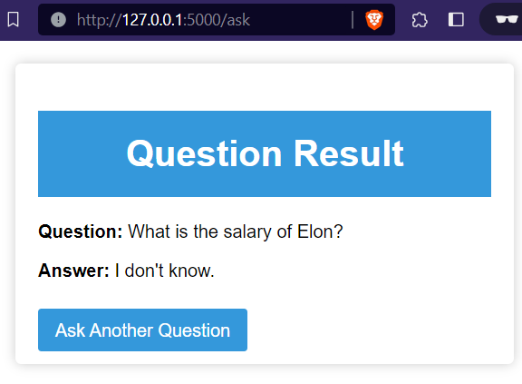
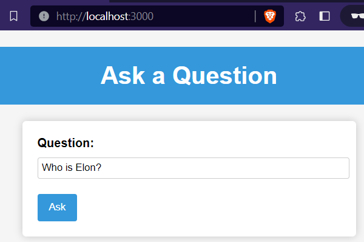
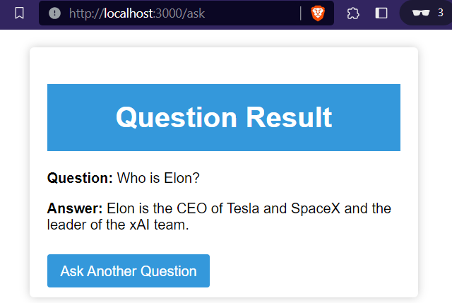

# Customer Support System using Web page (Flask and Node.js)

## Introduction
This project is a Customer Support System that uses web crawling, text embedding, and the OpenAI API to answer questions about webpages' content. It includes two implementations: `Command Line Based` and `Web Based`.

[Customer Support System (Google Slides)](https://docs.google.com/presentation/d/12nCGc0cTLNANdy5E32ED5QG6uSdT6HaiYG5wjZ0hu1w/edit?usp=sharing)

## Design
The system is designed to perform the following steps:

**1. Web Crawling:** It crawls webpages, extracts their text content, and stores it for further processing.

**2. Text Embedding:** The extracted text is tokenized and embedded into numerical representations using OpenAI's embedding models.

**3. Question Answering:** Users can ask questions about the crawled webpages, and the system generates responses using the embeddings and OpenAI's API.

### Command Line Based
In the command line-based implementation, users interact with the system through the Ubuntu terminal. They can ask questions about the webpages crawled by the system, and the system generates responses based on the embedded text data. This implementation provides a straightforward and text-based interface for users to query web content.

### Flask Web App
The web-based implementation utilizes the Flask framework to provide a user-friendly interface for interacting with the system. Users can access the system through a web browser, making it accessible and convenient. This web interface allows users to input questions and receive responses, enhancing the user experience and accessibility of the system.

### Nodejs Web App
Node.js web application is a simple yet effective tool that allows users to ask questions and receive answers in real-time. It leverages the Express.js framework to create a basic web server, and it integrates with a Python script to provide answers to user queries.

It demonstrate thes integration of Node.js and Python, showcasing how different technologies can work together to create a seamless user experience. Users can input their questions through a user-friendly web interface, and the application processes those questions using a Python script on the server side, returning the answers for display.

## Implementation 

### Ubuntu Terminal Setup
To run this project on an Ubuntu system, follow these steps:

* (**Optional**) Execute the complete code on Jupyter Notebook (`command_code.ipynb`) or Google Colab.

* Export the Jupyter notebook to .py and separate it into different parts (`crawl.py`, `embed.py`, `app.py`).

Further implementation can be done in three ways.

1) [Command Line Based](https://github.com/srikotturu/Machine-Learning/tree/main/ChatGPT/Command%20Line%20based)
2) [Flask Web app](https://github.com/srikotturu/Machine-Learning/tree/main/ChatGPT/Flask%20Web%20app)
3) [Nodejs Web app](https://github.com/srikotturu/Machine-Learning/tree/main/ChatGPT/Nodejs%20Web%20app)

## Output (Command Line based)
Note: I crawled the website www.x.ai

## Output (Flask Web app)

## Output (Nodejs Web app)

