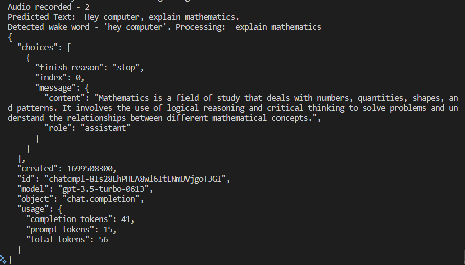

# Voice Assistant

## Introduction
This Python script serves as a voice assistant powered by OpenAI's GPT-3.5 Turbo model. The assistant listens for a wake word, transcribes the user's query, and generates a response using the ChatGPT API. The code structure includes three main components: recording audio, transcribing the audio, and replying to user requests.

[Google Slides (Voice Assistant)](https://docs.google.com/presentation/d/1UrSWyS5m60nJJs3K46Lc167nkGNC-lkjZ309qj6SuwM/edit?usp=sharing)

## Design
1. **Recording the Audio**
   - Records audio from a microphone using the SpeechRecognition library.
   - Converts the audio data to a Torch tensor and adds it to a queue (`audio_queue`) for further processing.
   - Output: `audio_queue`

2. **Transcribing the Audio**
   - Utilizes the Whisper ASR model to transcribe the audio data in the `audio_queue`.
   - Processes the transcribed text, extracts the wake word, and stores the result in a queue (`result_queue`).
   - Input: `audio_queue`, Output: `result_queue`

3. **Replying to User Request**
   - Continuously waits for results from the `result_queue`.
   - Uses the OpenAI ChatGPT API to generate responses based on user queries.
   - Handles potential errors, such as changes in the API response structure or key errors.
   - In both cases, the generated response is saved as an MP3 file and played back.
   - Input: `result_queue`, Output: ChatGPT response

## Implementation
1. Set up a virtual environment:
   ```
   python3 -m venv venv
   . venv/bin/activate
    ```
2. Install the required packages:
    ```
    sudo apt update && sudo apt install ffmpeg
    pip install -r requirements.txt
    ```

3. Run the script:
    ```
    python3 app.py
    ```

## Output


To hear the assistant's audio response, see the google slides. 